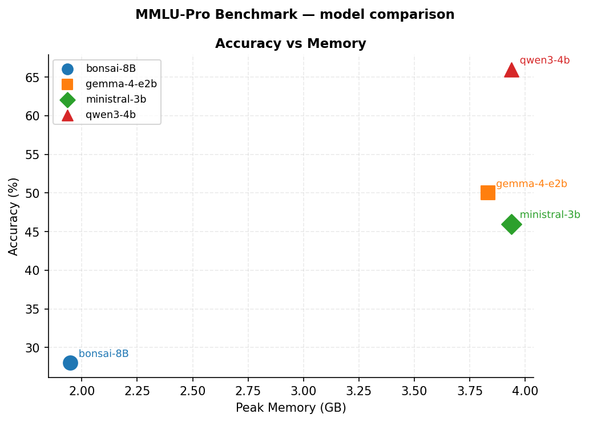

# mlx-bench

Benchmark MLX models on Apple Silicon. Measures **accuracy, time to first token (TTFT), tokens/second, and peak GPU memory** across multiple-choice datasets and any MLX-compatible model on HuggingFace.

---

## Requirements

- Apple Silicon Mac (MLX only runs on Metal)
- Python 3.11+
- [uv](https://docs.astral.sh/uv/) — install with `curl -LsSf https://astral.sh/uv/install.sh | sh`

---

## Setup

```bash
git clone https://github.com/roberto-ceraolo/mlx-bench.git
cd mlx-bench

# Install dependencies
uv sync

# (Optional) Download local models — only needed if you want to benchmark them
./setup.sh
```

`uv sync` is all you need to benchmark HuggingFace models (downloaded automatically on first run). `setup.sh` is only required for local models.

---

## Quick Start

```bash
# Run 200 stratified questions across the default model set
./scripts/run_benchmark.sh

# Quick test with fewer questions
./scripts/run_benchmark.sh --n 50

# Different dataset
./scripts/run_benchmark.sh --dataset arc-challenge --n 100

# Specific models
./scripts/run_benchmark.sh --models gemma-4-e2b,qwen3-4b --n 100
```

Results are written **incrementally** — safe to Ctrl-C and resume at any time. If you previously ran N=100 and now want N=200, the benchmark imports the first 100 results automatically rather than re-running them.

---

## Datasets

| Key | Dataset | Size | Notes |
|-----|---------|------|-------|
| `mmlu-pro` | [TIGER-Lab/MMLU-Pro](https://huggingface.co/datasets/TIGER-Lab/MMLU-Pro) | 12k | Expert-level, 14 categories **(default)** |
| `mmlu` | [cais/mmlu](https://huggingface.co/datasets/cais/mmlu) | 14k | 57 subjects |
| `arc-challenge` | [allenai/ai2_arc](https://huggingface.co/datasets/allenai/ai2_arc) | 1.2k | Grade-school science, hard |
| `arc-easy` | [allenai/ai2_arc](https://huggingface.co/datasets/allenai/ai2_arc) | 2.4k | Grade-school science, easy |

All datasets use stratified sampling by category and are downloaded automatically on first run.

To add a new dataset, write an adapter function and add an entry to the `DATASETS` dict in `scripts/benchmark.py` — the inline comments explain the schema.

---

## Models

Default model set:

| Key | Model | Source |
|-----|-------|--------|
| `bonsai-8B` | Bonsai-8B (1-bit MLX) | local — requires `./setup.sh` |
| `gemma-4-e2b` | Gemma-4 E2B 4-bit | auto-downloaded from HuggingFace |
| `ministral-3b` | Ministral 3B 4-bit | auto-downloaded from HuggingFace |
| `qwen3-4b` | Qwen3 4B 4-bit | auto-downloaded from HuggingFace |

To add your own model, edit the `MODELS` dict in `scripts/benchmark.py`:

```python
MODELS = {
    # HuggingFace repo ID — downloaded automatically
    "my-model": {"path": "mlx-community/Llama-3.2-3B-Instruct-4bit", "temp": 0.0},
    # Local path — resolved relative to the repo root
    "local-model": {"path": "models/my-local-model", "temp": 0.5},
}
```

Then: `./scripts/run_benchmark.sh --models my-model`

---

## Output

```
results/
├── benchmark.jsonl          # Raw results — one JSON record per (model, question)
└── plots/
    ├── accuracy_vs_memory.png
    ├── ttft_vs_memory.png
    └── tps_vs_memory.png
```

Plots are generated automatically at the end of each run. To print a summary table:

```bash
python scripts/benchmark_summary.py
python scripts/benchmark_summary.py --by-category          # per-category breakdown
python scripts/benchmark_summary.py --markdown report.md   # export markdown report
```

To regenerate plots manually:

```bash
python scripts/plot_benchmark.py
```

---

## Example Results

Benchmark run on a **MacBook Pro M5, 24 GB RAM** — 100 questions from [MMLU-Pro](https://huggingface.co/datasets/TIGER-Lab/MMLU-Pro) (stratified, seed=42).

> **Note:** 100 questions is a moderate sample — accuracy figures are indicative. Run with `--n 500` or more for stable estimates.

| Model | Accuracy | TTFT (s) | Tokens/s | Peak Memory (GB) | Avg Gen Tokens |
|-------|----------|----------|----------|-----------------|----------------|
| qwen3-4b (4-bit) | **62.0%** | 0.26 | 52.9 | 3.91 | 443 |
| gemma-4-e2b (4-bit) | 49.0% | 0.17 | **64.3** | **3.84** | 783 |
| ministral-3b (4-bit) | 47.0% | **0.17** | 59.0 | 3.91 | 615 |
| bonsai-8B (1-bit) | 34.0% | 0.39 | 81.9 | **1.99** | 621 |

bonsai-8B uses 1-bit quantization — it runs at **81.9 tok/s** and fits in under **2 GB of GPU memory**, making it the most memory-efficient option by a wide margin.


